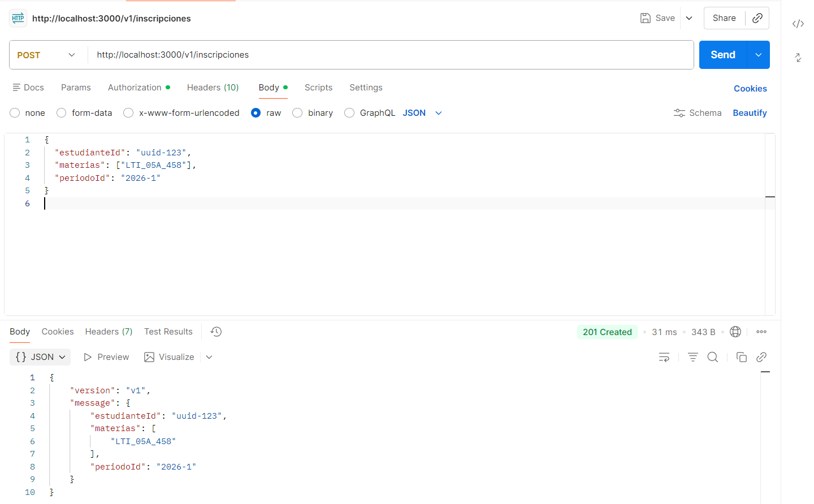
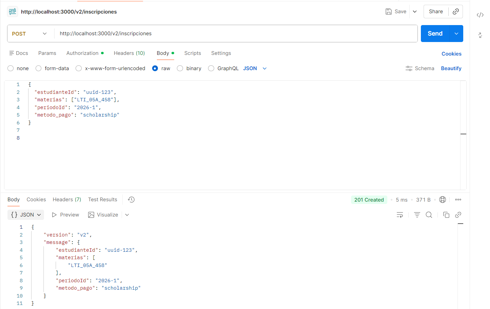
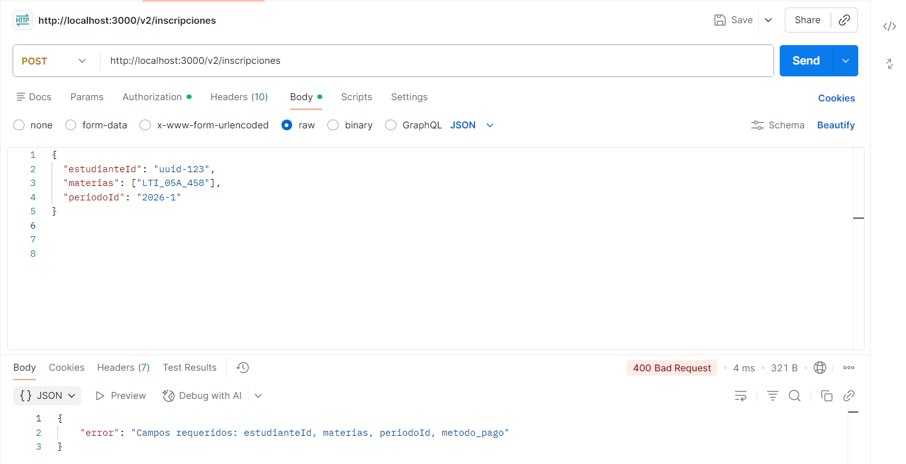
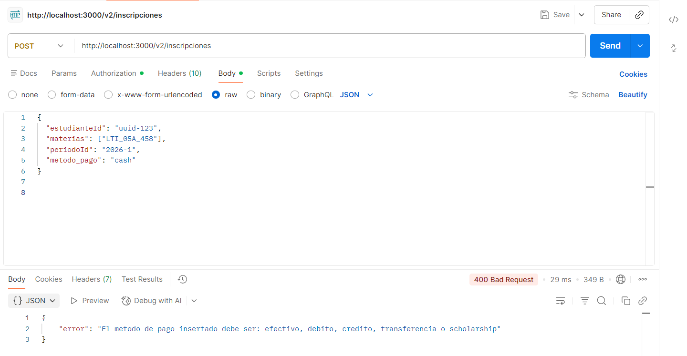
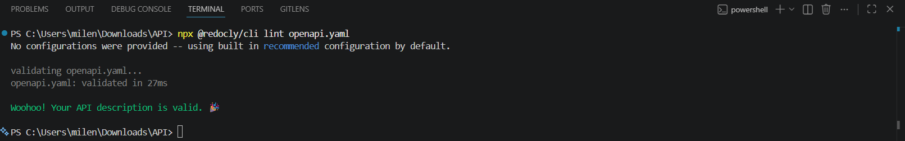

# Documentación de pruebas del servidor

## Escenario A: Sin API Key
- **Comando:** `curl http://localhost:3000/health`
- **Salida:**
{"error":"API key inválida o ausente"}
Explicación: El servidor deniega el acceso con  acierto y responde con un estado de error debido a que no fue enviada la clave de autorización en los encabezados.
## Escenario B: Con clave válida
- **Comando:** `curl -H "x-api-key: secreto-demo" http://localhost:3000/health`
- **Salida:**
{"code":200,"status":"API saludable","date":"2026-06-11T17:16:54.735Z"}
Explicación: Al enviar la clave correcta de la API (secreto-demo), el servidor autentica de forma correcta la petición y responde con un código de estado 200 junto con el estado de salud de la aplicación.
## Escenario C: Ruta existente
- **Comando:** `curl -H "x-api-key: secreto-demo" http://localhost:3000/noexiste
- **Salida:**
<!DOCTYPE html>
<html lang="en">
<head>
<meta charset="utf-8">
<title>Error</title>
</head>
<body>
<pre>Cannot GET /noexiste</pre>
</body>
</html>
Explicación: A pesar de que la clave sí es válida, el servidor responde con una estructura HTML de error indicando un "Cannot GET /noexiste" (error de tipo 404), porque no existe programada esa ruta.

## Testing
**Comando:** npm test
**Salida:**
> api@1.0.0 test
> node --experimental-vm-modules node_modules/jest/bin/jest.js

  console.log
    POST /usuarios -> 201 (0ms)

      at src/middlewares/logger.ts:6:13

(node:21392) ExperimentalWarning: VM Modules is an experimental feature and might change at any time
(Use `node --trace-warnings ...` to show where the warning was created)
 PASS  src/middlewares/logger.test.ts
  Pruebas para el Logger Middleware
    √ debe llamar a la funcion next() para continuar el flujo (2 ms)
    √ debe leer correctamente el metodo y la ruta (16 ms)

 PASS  src/middlewares/auth.test.ts
  Pruebas para el Verificador de API Key
    √ debe devolver error 401 si no se envia la API Key (1 ms)
    √ debe devolver error 401 si la API Key es incorrecta
    √ debe dejar pasar (llamar a next) si la API Key es correcta (1 ms)

Test Suites: 2 passed, 2 total
Tests:       5 passed, 5 total
Snapshots:   0 total
Time:        0.566 s, estimated 1 s
Ran all test suites.

## Pruebas de los endpoints

Servidor corriendo en `http://localhost:3000`. Autenticacion: header `x-api-key: secreto-demo`.

### Escenario 1 — POST /v1/inscripciones con campos válidos (esperado: 201)

### Escenario 2 — POST /v2/inscripciones con payment_method válido (esperado: 201)

### Escenario 3 — POST /v2/inscripciones sin payment_method (esperado: 400)

### Escenario 4 — POST /v2/inscripciones con payment_method inválido (esperado: 400)

### Validación del Contrato OpenAPI

## Consumo de la API por otro grupo
Si un  grupo de desarrollo alternativo empezase a usar esta API de aquí mañana, habría ajustes singulares en el contrato OpenAPI para asegurar una integración autónoma y sencilla. Primero, enriquecería las descripciones de los `schemas` agregando ` ejemplos ` y mensajes de error detallados para cada código de estado (en caso `400`, `401`), para que el grupo externo no tenga que adivinar la forma como son devueltas las respuestas defectuosas. En segundo lugar, formalizaría la forma y el límite de los datos (por ejemplo, validaciones de expresiones regulares para patrones UUID exactos). Y por último, añádiría una sección global de `servers` con las URL correspondientes para Staging y Producción, e incluiría una documentación muy detallada sobre el ciclo de vida y la expiración de la credencial de autenticación o ` x- api -key`.